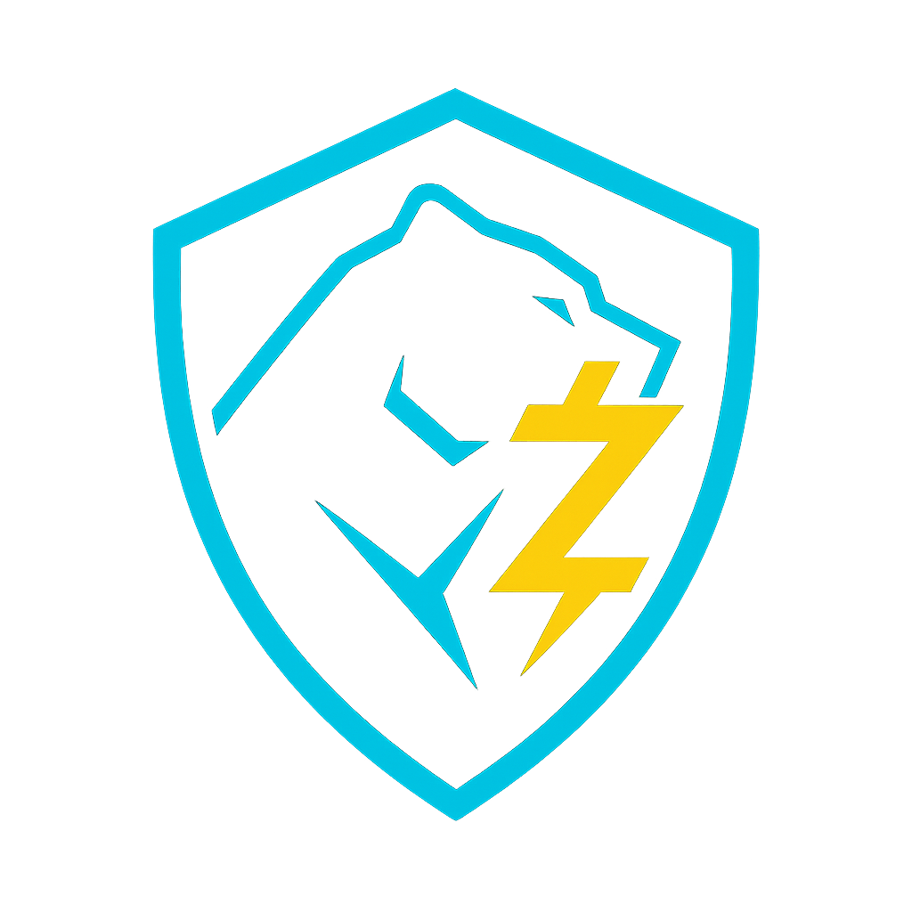

# 🛡️ Z-Ray — Private Zcash Explorer (Hackathon Edition)

> Local-only decryption. Web-only UX. Architecture ready for a real Zcash light client.

<p align="center">
  
</p>

<div align="center">

[**Live Demo**](https://z-ray.vercel.app/)  
[**Video Demo**](https://youtu.be/rbMmfEcqa_E)

</div>

---

## ✨ Overview

Z-Ray is a **privacy-first Zcash explorer** where shielded transactions are meant to be decrypted **locally in the browser**, using a **WASM light client running inside a Web Worker**.

This hackathon edition focuses on:

- A **solid, production-oriented architecture**:
  - React/Next.js App Router.
  - State layer with strict privacy guarantees.
  - TS ↔ Worker bridge for a future light client in WASM.
  - HTTP → gRPC proxy to public `lightwalletd` endpoints.
- A **full UX** (landing, explorer, dashboard, settings) that shows how a user would privately explore their shielded activity.

> ⚠️ **Important:**  
> The cryptographic engine (actual Zcash light client in WASM) is **not yet plugged in**.  
> The TS ↔ Worker ↔ “WASM slot” pipeline is implemented and tested, but decryption is still stubbed.  
> Demo Mode uses a simulated dataset to showcase the full product vision end-to-end.

Z-Ray is built to be **browser-only for sensitive data**:
- UFVK (viewing keys) **never** leave the browser.
- Decrypted balances & transactions **never** touch a backend or persistent storage.

---

## 🧭 High-level Architecture

```bash
                 Browser (Next.js + React)
                 ─────────────────────────
                 /            |          \
           Landing         Explorer     Dashboard
              |               |             |
              v               v             v
      ┌──────────────────────────────────────────┐
      │           React State Layer              │
      │  UISettings / ZRaySession / SensitiveData│
      └───────────────┬─────────────────────────┘
                      │ owns + orchestrates
                      v
      ┌──────────────────────────────────────────┐
      │        ZRayLightClient (TypeScript)      │
      │  - initializes Worker                    │
      │  - sends requests (init, sync, snapshot) │
      │  - streams compact blocks in chunks      │
      └───────────────┬─────────────────────────┘
                      │ postMessage RPC
                      v
      ┌──────────────────────────────────────────┐
      │  Web Worker (lightclient.worker.ts)      │
      │  - ensures WASM init (slot)              │
      │  - forwards UFVK to WASM                 │
      │  - ingestBlocks → (future) WASM          │
      │  - maintains syncStatus + snapshot       │
      └───────────────┬─────────────────────────┘
                      │ future calls
                      v
      ┌──────────────────────────────────────────┐
      │    WASM Zcash Light Client (todo)        │
      │  - setViewingKey                         │
      │  - ingestCompactBlocks                   │
      │  - getDecryptedSnapshot                  │
      └──────────────────────────────────────────┘

                      ^
                      │ uses
                      │
      ┌──────────────────────────────────────────┐
      │      LightwalletdClient (browser)        │
      │  - endpoint selection + failover         │
      │  - getLightdInfo / getCompactBlocks      │
      └──────────────────────────────────────────┘
    -                  ^
                      │ HTTP (same origin)
                      │
      ┌──────────────────────────────────────────┐
      │   Next.js API (Node, gRPC proxy)         │
      │  /api/lightwalletd/info                  │
      │  /api/lightwalletd/blocks                │
      │  /api/lightwalletd/tx                    │
      └───────────────┬─────────────────────────┘
                      │ gRPC (CompactTxStreamer)
                      v
      ┌──────────────────────────────────────────┐
      │        Public lightwalletd nodes         │
      └──────────────────────────────────────────┘
```

---

## 🚀 Key Features

- Local-only UFVK handling (by design)
    - UFVK is read from the onboarding form and passed directly to the light client bridge.
    - Not stored in React state, not sent to any server, not persisted.

- TS ↔ Worker WASM bridge implemented
    - Message protocol with requestId, action, typed responses.
    - Actions: init, setViewingKey, sync, ingestBlocks, getDecryptedSnapshot, clearSession.
    - Worker maintains syncStatus and a decrypted snapshot in memory.

- HTTP → gRPC lightwalletd proxy
    - Next.js API routes (/api/lightwalletd/*) talk to public lightwalletd nodes using gRPC.
    - Browser calls only same-origin HTTP JSON.
    - Backend never sees UFVK or decrypted data.

- Session-aware explorer & dashboard
    - /explorer reacts to session phases (NO_SESSION, READY_TO_SYNC, SYNCING, LIVE, ERROR).
    - /dashboard renders KPIs and Recharts-based graphs from decrypted data (or simulated data in Demo Mode).

- Sensitive data stored only in RAM
    - SensitiveDataProvider holds decrypted transactions & balances in React state only.
    - Wiped on session clear / refresh / tab close.

- Demo Mode for judges
    - ?demo=1 flag activates a fully simulated pipeline:
        - Fake decrypted transactions and balances.
        - Simulated sync phases and progress.
        - Full UX for explorer + dashboard.

---

## 🔐 Privacy Model

Z-Ray is built around a strict privacy model:

- UFVK (viewing keys)
    - Only exist in the browser.
    - Passed from the onboarding form into ZRayLightClient.setViewingKey({ ufvk }).
    - Forwarded to the Worker and then into the WASM slot.
    - Not stored in React context/state, not logged, not sent to /api/*.

- Decrypted data
    - Only lives in SensitiveDataProvider:
        - decryptedTransactions: DecryptedTransaction[]
        - balances: ZRayBalances | null
    - Never written to localStorage, IndexedDB, backend, or logs.
    - Wiped via clearSession() and clearSensitiveData().

- Backend
    - Only proxies public blockchain data:
        - Chain metadata (GetLightdInfo).
        - Compact blocks.
        - Raw transaction bytes (encrypted).
    - No UFVK, no decrypted notes, no balances.

The hackathon edition already enforces these boundaries; plugging in real WASM decryption will not require changing the privacy model.

---

## 🧬 Modes

Z-Ray supports two operational modes.

1. Infra mode (real network, crypto stubbed)

- NEXT_PUBLIC_ZRAY_MOCK_LIGHTWALLETD=0
- Browser → /api/lightwalletd/* → gRPC → public lightwalletd nodes.
- /settings shows real Zcash network status:
    - chain name
    - latest block height
    - active endpoint (with failover).
The TS ↔ Worker pipeline runs, but the WASM slot uses placeholder logic:
- No real decrypted balances/transactions yet.
- Explorer & dashboard rely on session phases and snapshots with empty arrays.

2. Demo Mode (full UX with simulated private data)

Activated via URL flag:

> https://z-ray.vercel.app/?demo=1


Behavior:
- Any UFVK-like string is accepted (no real decryption).
- Session phases are simulated:
    - INITIALIZING → READY_TO_SYNC → SYNCING → SCANNING → LIVE.
- useDashboardData() injects a local mock dataset of decrypted transactions when:
    - no real transactions available and/or
    - ?demo=1 is active.
- /explorer and /dashboard behave as if a real light client existed:
    - KPIs, charts, and private session messaging all work.

This is the recommended mode for hackathon judging.

---

## 🛠 Tech Stack

- **Framework**: Next.js 14 (App Router) + TypeScript
- **UI/Styling**: Tailwind CSS (CSS variables), shadcn/ui, Radix primitives
- **Charts**: Recharts
- **State & Session**:
    - Custom providers: ZRaySessionProvider, SensitiveDataProvider, UISettingsProvider
    - Dedicated hooks: useZRaySession(), useSensitiveData(), useDashboardData()
- **Lightwalletd Integration:**
    - @grpc/grpc-js + @grpc/proto-loader on the Node side
    - HTTP JSON API for the browser via /api/lightwalletd/*
- **WASM bridge:**
    - Web Worker (lightclient.worker.ts)
    - TS bridge (lightclient.ts)
    - Typed message protocol (lightclient.messages.ts)

---

## 📂 Repository Structure

```bash
z-ray/
├── app/
│   ├── page.tsx                  # Landing & UFVK onboarding
│   ├── explorer/page.tsx         # Private explorer shell (session-driven)
│   ├── dashboard/page.tsx        # Private analytics dashboard
│   ├── settings/page.tsx         # Network status (lightwalletd info)
│   └── api/
│       └── lightwalletd/
│           ├── info/route.ts     # HTTP → gRPC: GetLightdInfo
│           ├── blocks/route.ts   # HTTP → gRPC: GetBlockRange
│           └── tx/route.ts       # HTTP → gRPC: GetTransaction
│
├── components/
│   ├── layout/
│   │   ├── app-shell.tsx         # Global shell (header, central "lab panel")
│   │   └── header.tsx            # Logo, nav, theme toggle
│   ├── explorer/
│   │   └── PrivateViewBadge.tsx  # "Private view active/inactive" badge
│   └── dashboard/                # KPI cards & chart containers
│
├── lib/
│   ├── state/
│   │   ├── session-types.ts      # Session phases, actions, state shape
│   │   ├── session-context.tsx   # ZRaySessionProvider + useZRaySession()
│   │   ├── sensitive-data-context.tsx # Decrypted data in RAM
│   │   └── ui-settings-context.tsx    # Theme + preferred network
│   ├── wasm/
│   │   ├── lightclient.ts        # TS bridge (worker client)
│   │   ├── lightclient.worker.ts # Worker logic + WASM slot
│   │   └── lightclient.messages.ts# Request/response message contracts
│   ├── lightwalletd/
│   │   ├── endpoints.ts          # Static list of mainnet/testnet endpoints
│   │   ├── client.ts             # Browser LightwalletdClient + failover
│   │   └── LightwalletdProvider.tsx
│   └── analytics/
│       ├── types.ts              # Dashboard types & aggregates
│       ├── dashboard.ts          # Aggregation (KPIs, time series)
│       └── mock.ts               # Local mock dataset for demo mode
│
├── hooks/
│   └── useDashboardData.ts       # Maps session + sensitiveData → dashboard state
│
├── public/
│   └── logos/
│       └── zray-logo.png         # Logo used in header + README
│
├── grpc/
│   ├── service.proto             # CompactTxStreamer service definition
│   └── compact_formats.proto     # Compact block/message types
│
├── app/globals.css               # CSS variables for light/dark + layout styling
└── README.md

```

---

## 🌐 lightwalletd Integration (HTTP → gRPC)
- **Endpoints config: lib/lightwalletd/endpoints.ts**
    - Defines LIGHTWALLETD_ENDPOINTS for mainnet and testnet.
    - Each has: id, url, network, optional region and primary.
- **Browser client: lib/lightwalletd/client.ts**
    - Selects best endpoint via healthchecks (getLightdInfo).
    - Uses withFailover() for:
        - getLightdInfo()
        - getLatestBlockHeight()
        - getCompactBlocks(start, end)
        - getTransaction(txIdHex?)
- **Next.js API routes:**
    - /api/lightwalletd/info: resolves endpoint + calls GetLightdInfo.
    - /api/lightwalletd/blocks: resolves endpoint + GetBlockRange.
    - /api/lightwalletd/tx: resolves endpoint + GetTransaction.
All of these run with:
```bash
export const runtime = "nodejs";
export const dynamic = "force-dynamic";
```
to ensure a full Node environment for @grpc/grpc-js.

---

## 🧠 State & Session Layer
### ZRaySessionProvider (lib/state/session-context.tsx)

- Owns non-sensitive session state:
    - phase: "NO_SESSION" | "INITIALIZING" | "READY_TO_SYNC" | "SYNCING" | "SCANNING" | "LIVE" | "ERROR".
    - network: "mainnet" | "testnet".
    - hasViewingKey: boolean.
    - lastError: optional structured error.
- Public API (useZRaySession()):
    - state
    - startSession({ ufvk, network })
    - syncNow()
    - clearSession()
    - getLightClient(): ZRayLightClient | null
- **startSession():**
1. Creates a fresh LightwalletdClient for the given network.
2. Creates a ZRayLightClient (TS bridge).
3. Calls lightClient.init() and lightClient.setViewingKey({ ufvk }).
4. Wipes the local UFVK variable.
5. Sets phase = "READY_TO_SYNC".
- **syncNow():**
    - Calls lightClient.fullSync():
        - fetches latest height,
        - streams compact blocks in chunks,
        - uses failover.
- Updates phase through "SYNCING" → "LIVE" or "ERROR".

**SensitiveDataProvider (lib/state/sensitive-data-context.tsx)**
- Holds:
```bash
decryptedTransactions: DecryptedTransaction[];
balances: ZRayBalances | null;
isRefreshing: boolean;
lastUpdatedAt: number | null;
lastError: Error | null;
```

- Uses a callback getLightClient() from ZRaySessionProvider:
```bash
<ZRaySessionProvider>
  <SensitiveDataProvider getLightClient={getLightClientFromSession}>
    {children}
  </SensitiveDataProvider>
</ZRaySessionProvider>
```

- refreshFromLightClient():
```bash
const snapshot = await lightClient.getDecryptedSnapshot();
// snapshot.transactions + snapshot.balances
```

This is the only place where decrypted data enters the main thread.

**UISettingsProvider (lib/state/ui-settings-context.tsx)**
- Non-sensitive preferences:
    - theme: "light" | "dark" | "system"
    - preferredNetwork: "mainnet" | "testnet"
- Persists to localStorage under zray.ui.settings.v1.
- Applies/removes dark class on <html>.

---

## 📊 Dashboard & Analytics

The analytics layer lives in lib/analytics/:

- types.ts:/
    - TimeSeriesPoint
    - AggregateStats
    - DashboardFilters
    - DashboardData
    - Re-exports DecryptedTransaction and ZRayBalances.
- dashboard.ts:
    - computeAggregateStats(txs)
    - computeBalanceOverTime(txs, granularity, initialBalance?)
    - computeVolumeOverTime(txs, granularity)
    - computeTxCountOverTime(txs, granularity)
    - computeActivityByDayOfWeek(txs)
    - computeDashboardData(txs, balances, filters)
- mock.ts:
    - generateMockTransactions(count) for Demo Mode.
    - useDashboardData(filters):
- Reads:
    - phase, hasViewingKey from useZRaySession().
    - decryptedTransactions, balances from useSensitiveData().
- Maps to high-level status:
    > "no-session" | "syncing" | "empty" | "ready" | "error"
- When no real data and ?demo=1 (or env flag), injects mock transactions.

---

## ⚙️ Environment Variables

/.env.local:
```bash
# Use real lightwalletd via gRPC proxy (recommended for hackathon infra mode)
NEXT_PUBLIC_ZRAY_MOCK_LIGHTWALLETD=0

# Allow dashboard mock helpers (dev only; Demo Mode uses ?demo=1)
NEXT_PUBLIC_ZRAY_ENABLE_DASHBOARD_MOCK=false
```
> Demo Mode is driven entirely by the ?demo=1 query flag on the client side.

---

## 🧪 Running Locally
```bash
1. Install dependencies
npm install

2. Start dev server
npm run dev
# http://localhost:3000


3. Run in Demo Mode
http://localhost:3000/?demo=1


4. Check network status (optional)
Ensure NEXT_PUBLIC_ZRAY_MOCK_LIGHTWALLETD=0, then open:

http://localhost:3000/settings
```

You should see:
- Real chain name.
- Latest block height.
- Active endpoint information.

---
## 🚧 Current Limitations & Next Steps

**Limitations (Hackathon Edition)**

- WASM light client is a placeholder slot:
    - No real Zcash cryptography yet.
    - getDecryptedSnapshot() returns empty or simulated data.
- Public lightwalletd endpoints may:
    - Be flaky, especially on testnet.
    - Return gRPC INTERNAL errors for certain block ranges.
- Dashboard relies on a mock dataset in Demo Mode until real decrypted data is available.

**Next steps after hackathon**
1. Integrate real Zcash light client in WASM
    - Replace the stub in lightclient.worker.ts with the official or custom WASM module.
    - Implement:
        - setViewingKey(ufvk)
        - ingestCompactBlocks(blocks)
        - getDecryptedSnapshot() → { transactions, balances }.
2. Harden the gRPC proxy & endpoint pool
    - Fine-tune ranges for GetBlockRange.
    - Expand endpoint list.
    - Add metrics & observability.
3. Production hardening
    - Better error surfaces in /explorer & /dashboard.
    - Advanced filters, multi-UFVK support, and live updates.
The goal is to keep the current architecture unchanged, only swapping in a real cryptographic engine.

---

## 👥 Team
**Built by BlockBears 🐻 for the Zypherpunk Hackathon.**

> Mafer Lopez — Frontend, architecture & UX

> Zula — Product & coordination

> Mary — Research & support

---

## 📜 License

MIT © BlockBears Team